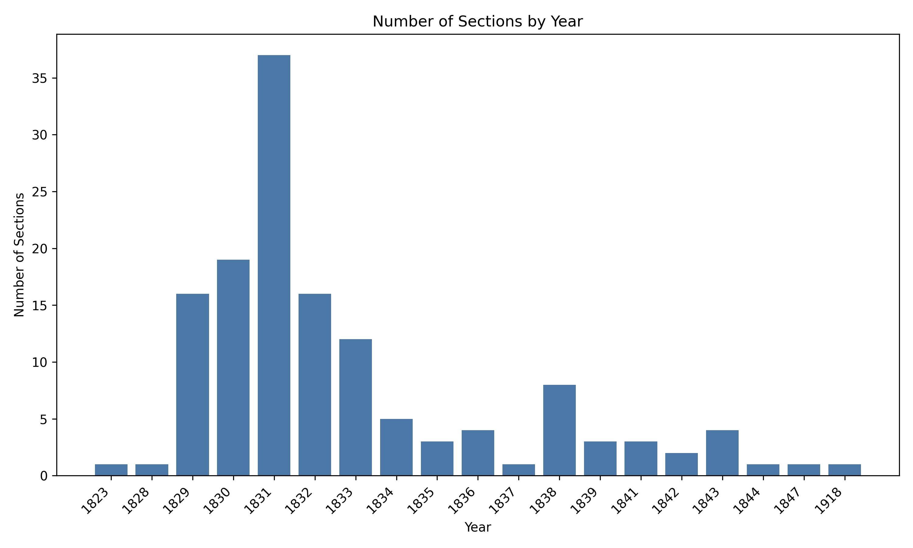
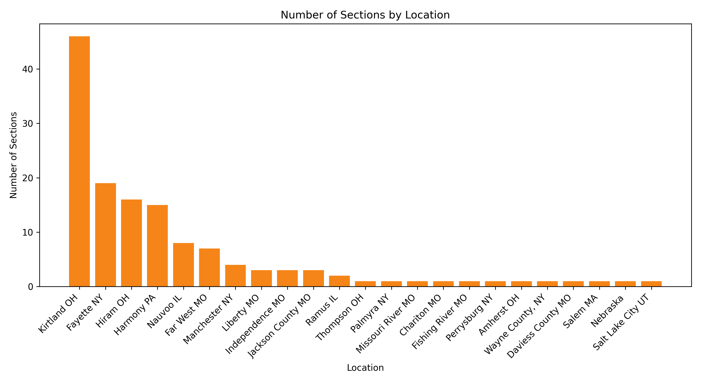
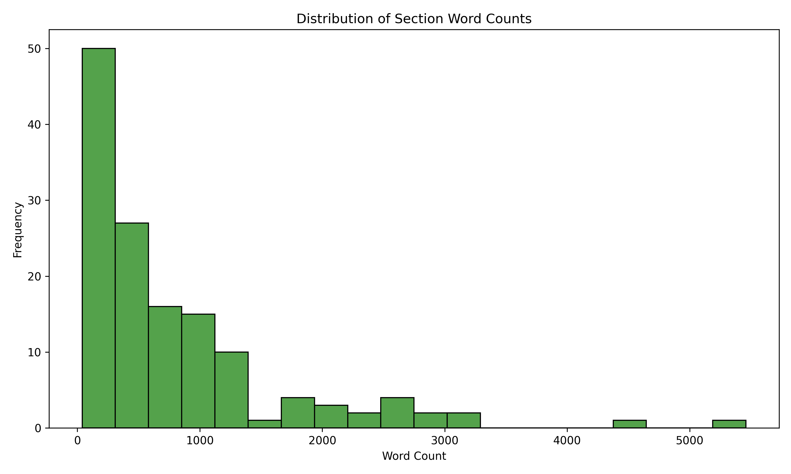
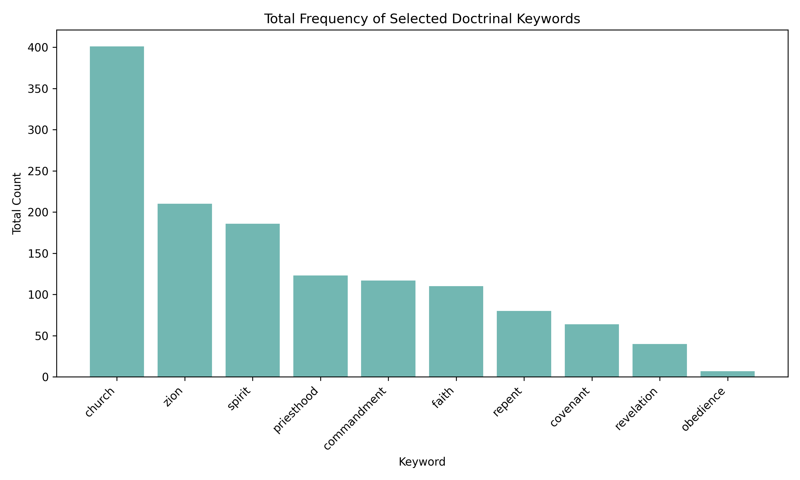

# Doctrine and Covenants Analysis

## Overview

This project uses statistical analysis to explore patterns in the Doctrine and Covenants. The goal was to analyze how revelation varies across time, location, and doctrinal themes, and to better understand how those patterns relate to real historical contexts.

This started as a capstone project for REL C 225 (Foundations of the Restoration) at BYU, but is presented here as a data analysis project combining text processing, visualization, and interpretation.

## Data
The dataset contains one row per section of the Doctrine and Covenants (excluding Official Declarations).

Each observation represents a single section with both textual and historical information.

Key variables:
- `section`: section number  
- `year`: year associated with the revelation  
- `location`: place where the revelation was received  
- `text`: original section text  
- `clean_text`: processed version of the text used for analysis  
- `word_count`: number of words in the cleaned text  

### Data Preparation
- Removed verse numbers and formatting artifacts from the original text  
- Standardized spacing and cleaned text for consistency  
- Converted year and word count to numeric values  
- Filled missing values where appropriate (e.g., unknown locations)  

This preprocessing ensured that word counts, keyword frequencies, and other analyses accurately reflect the content of each section rather than formatting noise.

## What I Did

### Data Processing

* Cleaned and structured scriptural text into a usable dataset
* Engineered features such as:

  * word counts
  * doctrinal keyword frequencies
  * normalized word variants

### Exploratory Analysis

Analyzed patterns across:

* Time (sections by year)
* Location (where revelation occurred)
* Section length distribution
* Word frequency and doctrinal emphasis

### Methods

* Keyword frequency analysis
* Word frequency distributions
* Custom stopword filtering
* Basic statistical summaries
* Data visualization

## Key Findings

* Revelation is **clustered in specific time periods**, especially early in Church history
* Revelation is **location-dependent**, concentrated in places like Kirtland
* Section lengths vary widely, suggesting different types of instruction
* Doctrinal keywords (e.g., covenant, priesthood, Zion) appear consistently across sections

Overall, patterns suggest that revelation is closely tied to real historical needs and contexts rather than being evenly distributed.

## Visualizations

### Sections by Year
Revelation is concentrated in specific time periods, especially the early 1830s.

### Sections by Location
Revelation is strongly associated with key locations such as Kirtland.

### Distribution of Section Lengths
Section lengths vary widely, suggesting different types of instruction.

### Doctrinal Emphasis
Certain doctrinal themes appear consistently across sections.

## Files

* `analysis.qmd` – full analysis (Quarto)
* `dc-analysis.py` – Python analysis + visualizations
* `doctrine-covenants-cleaned.csv` – cleaned dataset
* `figures/` – generated plots
* `final-report.pdf` – full written report

## Tools Used

* R (tidyverse, ggplot2)
* Python (pandas, matplotlib)

## Notes

This project intentionally combines technical analysis with interpretation. While statistical methods help identify patterns, they are used here as a tool to better understand structure and emphasis within the text, not to replace doctrinal or spiritual interpretation.
